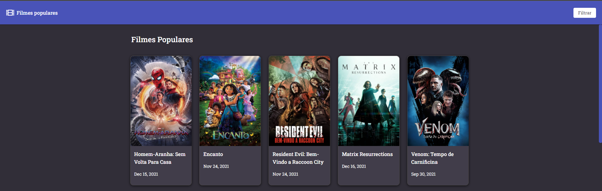

<div align="center" style="margin-bottom: 20px;">


</div>

<div align="center" style="margin: 20px;">

[](http://github.com/josejustino/front-end-challenge/LICENSE.md)

[](https://www.codacy.com/gh/josejustino/front-end-challenge/dashboard?utm_source=github.com&amp;utm_medium=referral&amp;utm_content=josejustino/front-end-challenge&amp;utm_campaign=Badge_Grade)


<p align="center" >
  <a href="#fire-prévia-da-aplicação"> :fire: Prévia da Aplicação</a>&nbsp;|
  <a href="#rocket-tecnologias-usadas"> :rocket: Tecnologias Usadas</a>&nbsp;|
  <a href="#thinking-como-contribuir?"> :thinking: Como Contribuir?</a>&nbsp;|
  <a href="#zap-executando-o-projeto"> :zap: Executando o Projeto </a>
</p>

</div>

## :barber: O projeto

Aplicação criada para listar filmes populares utilizando a api do themoviedb.

## :fire: Prévia da Aplicação

<div align="center">

</div>

### :rocket: Tecnologias Usadas

O projeto foi feito com as seguintes tecnologias:

- [ReactJS](https://pt-br.reactjs.org/)
- [Ant-Design](https://ant.design/)
- [React-Hook-Form](https://react-hook-form.com/)
- [Styled-Components](https://styled-components.com/)
{...}

## :thinking: Como Contribuir?
**Faça um fork deste repositório**

```bash
# Clone o seu fork
$ git clone url-do-seu-fork && cd front-end-challenge

# Crie uma branch com sua feature ou correção de bugs
$ git checkout -b minha-branch

# Faça o commit das suas alterações
$ git commit -m 'feature/bugfix: minhas alterações'

# Faça o push para a sua branch
$ git push origin minha-branch
```

Depois que o merge da sua pull request for feito, você pode deletar a sua branch.

## :zap: Executando o Projeto
#### Clonando o projeto
```sh
$ git clone https://github.com/josejustino/front-end-challenge.git
$ cd front-end-challenge
```
#### Iniciando o Projeto
```sh
$ yarn && yarn start
```
### :memo: Licença

Este projeto é desenvolvido sob a licença MIT. Veja o arquivo [LICENSE](LICENSE.md) para saber mais detalhes.

<p align="center" style="margin-top: 20px; border-top: 1px solid #eee; padding-top: 20px;">Feito com :purple_heart: by <strong> José Justino</strong> </p>
